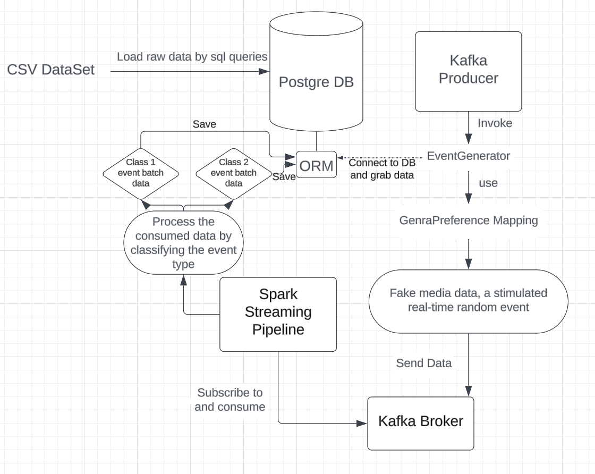

## Project Overview

This repository contains a simulated large-scale data generation, streaming, and processing pipeline designed to deliver seamless real-time media data to customers. The data originates from a Kaggle dataset and is transformed to synthetic data using the `Faker` Python library, then data is processed and stored in PostgreSQL, making it suitable for downstream analytics and recommendation systems.

## System Architecture

* Data Ingestion:
The system utilizes **Apache Kafka** for real-time data ingestion. A Kafka producer publishes synthetic events taken from raw data source to predefined Kafka topics, simulating real-world media data collection.

* Data Streaming and Processing
The synthetic data is consumed by **PySpark** Structured Streaming, which processes messages from Kafka in distributed computing capability. This ensures efficient data transformation and streaming data in real-time.

* Data Storage & Accessibility:
The transformed data is stored in **PostgreSQL**, making it accessible for analytical queries and serving as a foundation for recommendation systems and other machine-learning applications in media data warehousing.

* Containerization
The entire system is containerized using **Docker** and orchestrated via Docker Compose to facilitate inter-service communication. 


In the future this allows for easy deployment in a distributed Kubernetes cluster, ensuring high availability (HA) and scalability in production environments.

## Local Development Setup

Please make sure you have: **Docker**, **Python 3.10**, **Miniconda or Anaconda**

### Instruction to Start the Project

#### Start DB Instance
```shell
docker-compose -f database_setup/docker-compose.yml up -d --build
```


#### Database Connection in Docker Container
```shell
psql -U pyspark -d media_db
```

#### Start Kafka Instance
```shell
docker-compose -f kafka/docker-compose.yml up -d --build
```

#### Start Spark Instance
```shell
docker-compose -f spark/docker-compose.yml up -d --build
```

### Rest of the Helpful Docker commands
<details>
<summary>PSQL</summary>

#### Stop
```shell
docker-compose -f database/docker-compose.yml down
```

#### Remove DB
```shell
docker rm musicDB
```
</details>

<details>
<summary>Kafka</summary>

#### Stop Kafka Instance
```shell
docker-compose -f kafka/docker-compose.yml down
```
</details>

<details>
<summary>Spark</summary>

#### Stop Spark Instance
```shell
docker-compose -f spark/docker-compose.yml down
```
</details>

### Tech Stack Used

#### Languages
<div style="display: flex; gap: 10px; align-items: center;">
  
  
</div>

#### Frameworks & Libraries
<div style="display: flex; gap: 10px; align-items: center;">
  
  
  
  
</div>

### System Diagram

The following diagram illustrates the architecture of the data pipeline:

